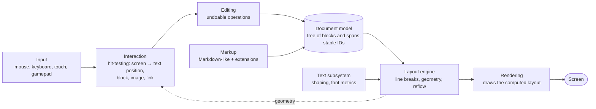

# Architecture diagram

Data flow of the layers described in `PROPOSAL.md` §4. The content model is
the source of truth; layout and rendering are derived from it.

```mermaid
flowchart LR
    Input["Input<br/>mouse, keyboard, touch, gamepad"] --> Interaction
    Interaction["Interaction<br/>hit-testing: screen → text position,<br/>block, image, link"] --> Edit
    Edit["Editing<br/>undoable operations"] --> Model
    Markup["Markup<br/>Markdown-like + extensions"] --> Model
    Model[("Document model<br/>tree of blocks and spans,<br/>stable IDs")]
    Model --> Layout["Layout engine<br/>line breaks, geometry, reflow"]
    Text["Text subsystem<br/>shaping, font metrics"] --> Layout
    Layout --> Render["Rendering<br/>draws the computed layout"]
    Layout -. geometry .-> Interaction
    Render --> Screen(["Screen"])
```
